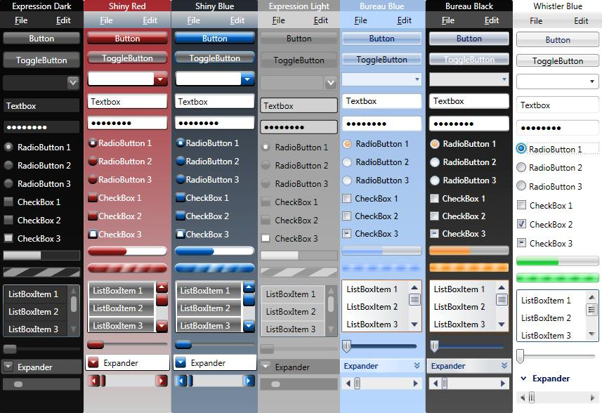

##How to Use the WPF Themes

Here the Demo:



How to use the WPF Themes in your application:

`Resource dictionary` You can use the themes as a resource dictionary. Add the xaml file of the desired theme to your project (in Visual Studio, right-click on the project in the Solution Explorer, choose Add --> Existing File and select the appropriate .xaml file) and make sure your project also includes a reference to WPFToolkit.dll (the themes depend on VSM). In App.xaml, add a reference to the desired theme to the Application.Resources. For example,

``` xaml
<Application x:Class="ThemesSample.App"
    xmlns="http://schemas.microsoft.com/winfx/2006/xaml/presentation"
    xmlns:x="http://schemas.microsoft.com/winfx/2006/xaml"
    StartupUri="Window1.xaml">
    <Application.Resources>
        <ResourceDictionary Source="ExpressionDark.xaml"/>
    </Application.Resources>
</Application>
```


###Where you can find ? Here
[Source](https://wpf.codeplex.com/wikipage?title=WPF%20Themes&referringTitle=Home)  

###Other Demo
[WPF Theme](http://professorweb.ru/my/WPF/themes/DarkOrange_UI/theme_or.php)   